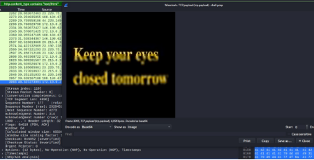

# MILANCTF25 WRITEUP

## OSINT

### Find Me

Used the google street name displayed, to find the name of the hotel far off in the image, then used google maps to go to the hotel and found the exact street and barber shop easily as it was pretty empty and open hence found the county and state:

> Trøndelag, Kyrksæterøra

## BINARY EXPLOITATION

### SideTick

Tools used: radare2

Read the program flow using radare2 -- `r2 -A chall` and it was easily visible

It reads 12 bytes → Allocs 16 bytes → For each index i it XORs with a table (also can be seen through disassembler/ gdb) and index and adds them so we get the following password:

```
index: 0 1 2 3 4 5 6 7 8 9 10 11
table: '9 F 7 A i 0 ~ L r z c C'
xor i: 0 1 2 3 4 5 6 7 8 9 a b
result: '9 G 5 B m 5 x K z s i H'
```

**Whats the password:**

Tools used: radare2

Again I saw the radare2 disassembly and saw the strcmp for passwords and got → 'w00fw00f' and 'm30wm30w' but that just lead to the program reaching its end without the flag.

```assembly
0x00400586: mov esi, str.w00fw00f ; 0x4013f3 ; "w00fw00f" ; const char *s2
0x0040058b: mov rdi, rax ; const char *s1
0x0040058e: call sym.imp.strcmp ; int strcmp(const char *s1, const char *s2)
```

So I read through the disassembly from first. The binary copies a string into the same buffer used for inputs. After the first input is accepted, the code compares the second input against that string. Because the canary was previously copied into the format entering that exact string as the second password satisfies the check.

```assembly
mov rax, qword [obj.canary] ; [0x403058:8]=0x401388
str.Youre_not_supposed_to_see_this__n

add rcx, edx ; rcx = format + (var_4h + 1)
mov rsi, rax ; rsi = canary (src)
mov rdi, rcx ; rdi = format + (var_4h + 1) (dest)
call strcpy ; strcpy(format + var_4h + 1, canary)
```

**Final recon:**

```bash
$ nc milan.kludge.co.in 10001

Quick, what's the password? w00fw00f
w00fw00f

Ok cool, what's the second password? You're_not_supposed_to_see_this!
You're_not_supposed_to_see_this!

Sorry, the password is not You're_not_supposed_to_see_this!!

!kludgectf{w4nna_ov3rfl0w_my_buff3r_0283}

Quick, what's the password?
```

## FORENSICS

### Hidden In Plain Sight

Examining the efix data recovered the flag.

### Starry Night

**Files:** pillars2.jpg\
**Tools used:** exiftool, binwalk, cp, steghide, python\
Examining the JPG exiftool and binwalk revealed a PDF inside the JPG.
The PDF contained text (x,y) referencing EXIF GPS metadata --- that
coordinate string was also the password for a steganography container
embedded in the original JPG. This revealed txt with \* and on going
thru the long text we get a QR like image. Wrote a python program to
turn \* to pixels and map to image using PIL library.

**Code:**

```python
from PIL import Image

qr_text = """

********* * *** **** *******
* * * ** * * *
* *** * * * * * *** *
* *** * ** **** * * *** *
* *** *** ** * *** *
* * * * ** ** * * *
********* * * * * * * *********
** * **
* ***** ****** * ** *****
* * * ** * * * **
** * ** ** ** * * **
** * ** *** ** * *
* ** ** *** * * *
* ** * * *********
* ******* ****** * * *
* ** ** * * * *
* *** ** ** * * ***
* *** **** **** ***
* ** *** *** ** * ****
* *** ** * **** ***
* * ************ *
* ** ** ** ** **
********* * **** * * *
* * * * *** ** *
* *** * *** ** ***** *
* *** * * ** ** * * *
* *** * ** ****** * * *
* * * * ** *
********* * ****** * * ***
"""


def text_to_image(text, pixel_size=10):

    lines = text.strip('\n ').split('\n')

    height = len(lines)
    width = max(len(line) for line in lines)
    
    img = Image.new('1', (width, height), 1)  # 1 = white


    for y, line in enumerate(lines):

        for x, char in enumerate(line):

            if char == '*':

                img.putpixel((x, y), 0)  # 0 = black

            else:
                img.putpixel((x, y), 1)  # 1 = white

    return img

img = text_to_image(qr_text)
img.save("qr.png")
print("QR code image saved as 'qr_.png'")
img.show()
```

Scanning the QR gave the flag.


### Spectral Whisper

Files provided: chall.jpg

Tools used:aperisolve.com ,
<https://ejectamenta.com/imaging-experiments/fourifier/>, exiftool

Got a jpg file, ran file exiftool to see metadata, got comment (e\^jwt
)-\> Hint to fast fourier transformation being applied to image. Used
online tool fourifier to apply FFT filter and got this image(Left
image).

{width="2.283082895888014in"
height="2.240803805774278in"}
{width="2.3041765091863518in"
height="2.291755249343832in"}

There are three layers of text visible here, the yellow and red can be
read, so I tried applying FFT to blue bitplane of the initial img and
got the final layer (Right image).

### DNA

Files:order.png

Tools used: python

Took the image and turned it into a tensorflow tensor and encoded it as
per the challenge hints

(Red from Red Wedding GOT)

And from the final para of challenge got the artist Lady Gaga -\> Latest
song -\> The Dead Dance

Another way : Just try artist names possible from ATGC , you might get
lucky.

## CRYPTOGRAPHY

### CrYpTo

Files given : py.py, encrypted.txt

Tools Used: cat, nano, python

Examining the give python code (the comments made it obvious) Its
Hastads attack for small exp in RSA.

Thecode takes 5 strings (four poem lines + the flag), duplicates the
list three times and shuffles it, then for each message generates a
fresh 2048‑bit RSA mod n = p\*q, sets e = 3, converts the bytes to an
integer ( with bytes_to_long) and calcs c = m\^e mod n, appending n,e,c
to encrypted.txt.

Because each plaintext is encrypted3 times with the same small exponent
and distinct moduli we can collect the three ciphertexts for the same
message, use the Chinese Remainder Theorem to reconstruct m\^3 modulo N
= n1\*n2\*n3 (which equals the true integer m\^3 since m\^3 \< N for
short messages), take the integer cube root, and recover m .

Libraries used : gmpy2 - fast arithmetic on big numbers, Crypto -- bytes
to int and back. Re -- regular expression matching , itertools - looping
over

```python
from itertools import combinations
import re,gmpy2
from Crypto.Util.number import long_to_bytes

r=[(int(n),int(e),int(c)) for n,e,c in re.findall(r"n:\s*(\d+)\s*e:\s*(\d+)\s*ciphertext:\s*(\d+)",open("encrypted.txt").read())]

for (n1,e1,c1),(n2,e2,c2),(n3,e3,c3) in combinations(r,3):
    if e1!=3 or e2!=3 or e3!=3: continue
    M=n1*n2*n3
    x=(c1*(n2*n3)*gmpy2.invert(n2*n3,n1)+c2*(n1*n3)*gmpy2.invert(n1*n3,n2)+c3*(n1*n2)*gmpy2.invert(n1*n2,n3))%M
    root,ok=gmpy2.iroot(x,3)
    if ok: print(long_to_bytes(int(root)))
```

### Ritchie's Last Wish

Files provided : script.py , secret.dat

Tools used : python (numpy, matplotlib)

Examining the script.py we see the code loads data from data.txt,
scrambles the data using LCG

(<https://en.wikipedia.org/wiki/Linear_congruential_generator>) then
XOR's it with a diff LCG (seed+1) and saves to data.txt. The seed
however is not present for this we need to decode the description of the
challenge.

From there we get the seed by the clues : the book -\> C Programming
Language by Brian Kernighan and Dennis Ritchie

Year published -\> 1978

**Next is writing a decryption script:**

```python
import numpy as np

class LCG:
    def __init__(s,seed): s.state=seed; s.a=1103515245; s.c=12345; s.m=2**31
    def next(s): s.state=(s.a*s.state+s.c)%s.m; return s.state

seed=1978
enc=open("secret.dat","rb").read()
ks=LCG(seed+1)
t=[b ^ ((ks.next()>>8)&0xFF) for b in enc]
pr=LCG(seed)
pairs=[(i, pr.next()%(i+1)) for i in range(len(t)-1,0,-1)]
arr=list(t)
for i,j in reversed(pairs): arr[i],arr[j]=arr[j],arr[i]

data=np.array(arr,dtype=np.uint8)
np.savetxt("data.txt",data,fmt='%d')
```

Load the data -\> Reverse by XOR ing the data with keystream from LCG
with seed = 1978+1

-   Reverse with the same LCG -\> Reshape and store the result -\> This
    reveals a stream of bytes,

Next again from the challenge descript we get the heatmap hint -\>
mapping the bytes as heatmap.

So we need to resize the bytes into 2D array -- possible shapes \[(40,
80), (10, 320), (16, 200)\]

With "grid = data.reshape((r, c))"

Then map with plt.imshow(grid, cmap=cmap, aspect=\"auto\") and we get
the flag.

Nice challenge.

## REVERSE ENGINEERING

### Helio's Message

Files : backup.ab

Tools used: <https://github.com/nelenkov/android-backup-extractor>

<https://github.com/skylot/jadx>

First search for android backup extractor tools and got ABE, ran the
command

java -jar abe.jar unpack backup.ab backup.tar

tar -xf backup.tar

Navigated to /apps and saw structure with

Tree -L 3 apps

Got -\> com.securechat -\> base.apk and messages.db

Saw messages.db was sql db and extracted messages with\
SELECT sender, content FROM messages;

Now these were encrypted via some method employed by the securechat app

So I thought of going through base.apk to see encryption logic and found
this

{width="5.224219160104987in"
height="3.3388123359580053in"}

The code took "pure_blood"(from challenge descript) as the key and took
the first digit of hashes of the numbers 0, 1, 2, and so on ig till 500
then encrypted the msg (only the last msg contained the flag).

## WEB + OSINT

### Hidden Trail

Tools used : TinyEye (to reverse search the images)

Given site revealed 12 images of 12 places-

stockholm/sweden, Zurich/Switzerland, helsinki/finland, Madrid/Spain,
Yangon/Myanmar, Rome/Italy, Yokohama,Japan, Frankfurt/Germany,
Quebec/Canada, Giza/Cairo/Egypt, Sydney/Australia, Istanbul/Turkey

(The Giza image was misguiding, it was Cairo)

And on inspecting the source code we find a comment base64 encoded and
on decoding find /project_loon endpoint.

The endpoint was a login page with a password input.

The password was the first letter of all the places combined in lower
case -\> got the flag.

## OSINT + FORENSICS

### Packet Song

File: chall.pcap

Tools used: wireshark

Opened the given pcap on wireshark and started inspecting the packets.
First with filter for text/html:

http.content_type contains \"text/html\"

Then found a Pastebin link (password protected) and some random strings,
eventually stumbled upon a base64 looking packet which I viewed with
(ctrl+shift+o) on the packet data -\> decode as base64 -\> Saw the
header file was an image -\> Show as : Image

Got this image

{width="4.6982983377077865in"
height="2.3968350831146106in"}

Given the challenge name and this phrase the first thing the came to
mind was Hollow Knight Silksong -\> Tried the password silksong on
pastebin which was correct -\> Got the flag.